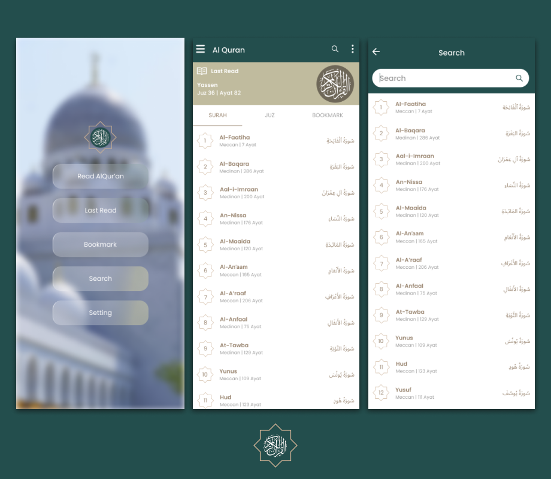
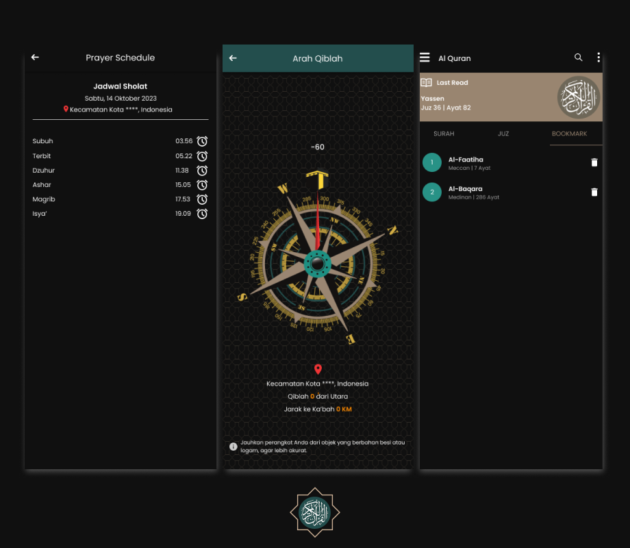

<!-- PROJECT LOGO -->

  
  <h3 align="center">Al-Quran Online</h3>
  
Al-Qur'an For Android 

## Al-Qur’an App

An Flutter App. Al Quran App is the app that all you need for Reading Al Quran Anywhere you wanted.
It is the good time to make yourself to be more mind, and rest your thought for an while to read Qur’an.

### API Information

API Used: https://alquran.cloud/

### Screenshots

  

### Features

- [x] Contains All 114 Surah and 30 Juz, and with the translated English.
- [x] Beautiful UI for better experience using the app.
- [x] Able to save the last page read.
- [x] There is an audio player of verses' recitation on each page.
- [x] Bookmarks your verse in the Surah.
- [x] Searching the Surah that you wanted.
- [x] Can see prayer schedule according to the current location.
- [x] Qiblah Direction.

### GitHub

View Github
by irulfadil @DjonkCreative

#Quran #Apps

### Contact

@DjonkCreative
